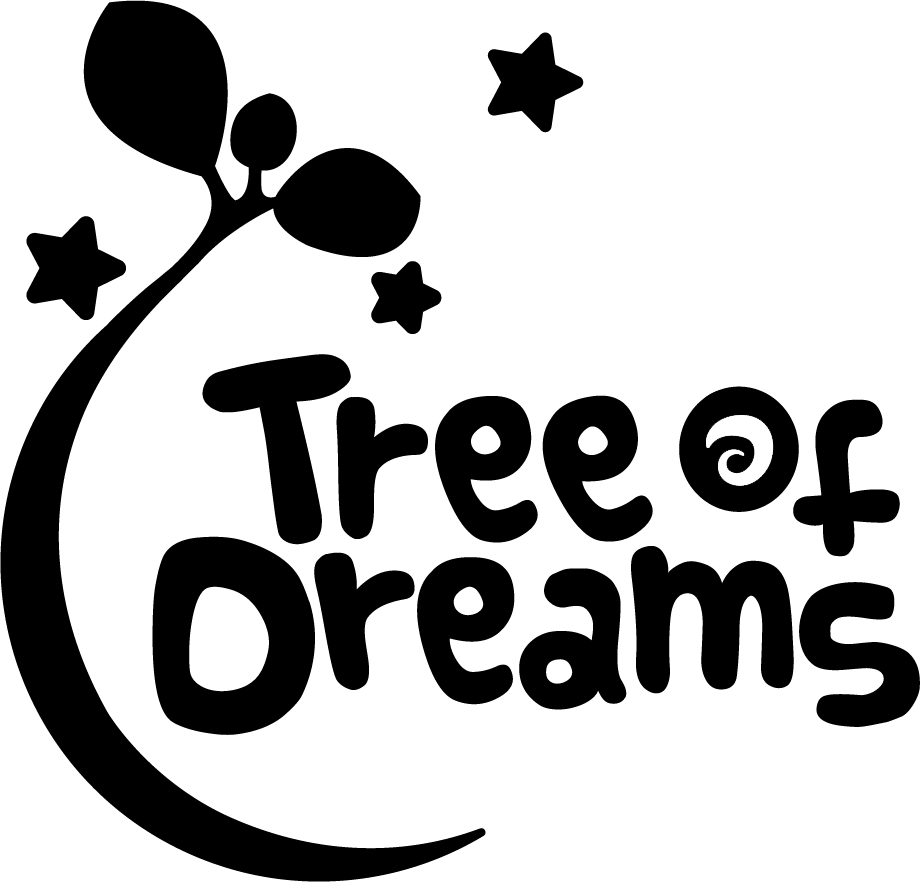

    

## Tree of Dreams (Student Project)

Tree of Dreams is a 3D Farming Game made in Unity

#### Links

Homepage: http://treeofdreams.school4games.net/
itch.io: https://s4g.itch.io/tree-of-dreams

### Team

  - Paulina Pabst (Producer) [LinkedIn](https://de.linkedin.com/in/paulinapabst)
  - Christian Leder (Game Design) [LinkedIn](https://www.linkedin.com/in/christian-l-024256173/)
  - Cornelius Nitschkoff (Game Design) [LinkedIn](https://www.linkedin.com/in/cornelius-nitschkoff-669546182/)
  - Jeremy Froböse (Music) [Website](https://www.jeremyfroboese.com/)
  - Felix Konprecht (Engineer) [LinkedIn](https://www.linkedin.com/in/felix-konprecht-943469181/) | [GitHub](https://github.com/Solek798)
  - Bryan Printz (Engineer) [LinkedIn](https://www.linkedin.com/in/bryan-printz/) | [GitHub](https://github.com/Bryanprintz)
  - Jessy Lee (Artist) [ArtStation](https://www.artstation.com/pixelcr0wn)
  - Michelle Lottra (Artist) [LinkedIn](https://www.linkedin.com/in/michichrom/)
  - Nadim Chreide (Artist) [ArtStation](https://www.artstation.com/nadim-chreide)
  - Ronja Brodocz (Artist) [LinkedIn](https://www.linkedin.com/in/ronja-brodocz-b64b41173/) | [Behance](https://www.behance.net/ronjabrodocz)
  - Katarina Stadler (Artist) 
  - Edward Agwi (Artist) [ArtStation](https://www.artstation.com/shiv0r)

### Technical Documentation

  - [Technical Design Document](Docs/Dream-Tree_TDD.pdf)

### How to build

#### Required Engine Version: Unity 2019.1.x

  - load the Unity project with teh correct Engine version
  - this will generate and compile all required files
  - build the project with the Unity build tool
